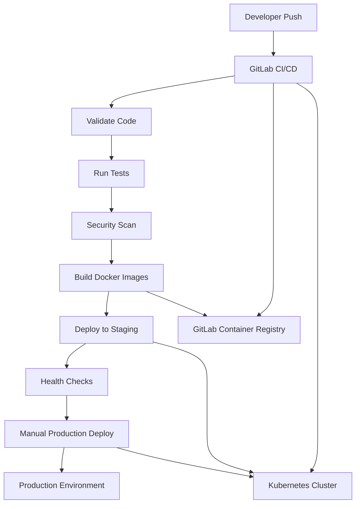

# GitLab CI/CD Deployment Guide

## 🚀 Overview

This guide explains how to deploy AutoMind AI Assistant using GitLab CI/CD pipeline with comprehensive automation, security scanning, and multi-environment deployment.

## 🏗️ Architecture



## 📋 Prerequisites

### GitLab Setup
1. **Create GitLab Project**
   - Fork or create new project at `https://gitlab.com/sbusanelli/automind`
   - Enable CI/CD in project settings
   - Configure protected branches (main, develop)

2. **Container Registry**
   - Enable GitLab Container Registry
   - Set up authentication tokens for Docker push/pull
   - Configure image retention policies

3. **Kubernetes Integration**
   - Connect GitLab to Kubernetes cluster
   - Configure cluster contexts (staging, production)
   - Set up service accounts and RBAC

### Environment Variables
Configure these in GitLab CI/CD variables:

| Variable | Type | Protected | Description |
|----------|------|-----------|-------------|
| `CI_REGISTRY_URL` | Variable | No | GitLab container registry URL |
| `CI_REGISTRY_USER` | Variable | Yes | GitLab deploy token username |
| `CI_REGISTRY_PASSWORD` | Variable | Yes | GitLab deploy token password |
| `KUBE_CONTEXT_STAGING` | Variable | Yes | Kubernetes staging context |
| `KUBE_CONTEXT_PRODUCTION` | Variable | Yes | Kubernetes production context |
| `DATABASE_URL` | Variable | Yes | Production database connection |
| `REDIS_URL` | Variable | Yes | Redis connection string |
| `JWT_SECRET` | Variable | Yes | JWT signing secret |
| `OPENAI_API_KEY` | Variable | Yes | OpenAI API key |

## 🔧 GitLab CI/CD Pipeline

### Pipeline Stages

#### 1. Validate Stage
```yaml
frontend:validate & backend:validate:
  - Type checking (TypeScript)
  - Linting (ESLint + Prettier)
  - Code formatting validation
```

#### 2. Test Stage
```yaml
frontend:test & backend:test:
  - Unit tests with Jest
  - Integration tests with test database
  - Coverage reporting (Cobertura format)
  - Test artifacts for GitLab reports
```

#### 3. Security Stage
```yaml
security:audit & security:sast:
  - npm audit for vulnerability scanning
  - Semgrep SAST scanning
  - Security reports in GitLab security dashboard
  - Fail pipeline on high severity issues
```

#### 4. Build Stage
```yaml
frontend:build & backend:build:
  - Multi-stage Docker builds
  - Image caching for faster builds
  - Push to GitLab Container Registry
  - Tag with commit SHA and 'latest'
```

#### 5. Deploy Stage
```yaml
deploy:staging:
  - Automatic deployment on develop branch
  - Kubernetes deployment with rolling updates
  - Health checks and rollback capability
  - Environment URL: https://staging.automind.ai

deploy:production:
  - Manual deployment from main branch
  - Production Kubernetes deployment
  - Extended health check timeouts
  - Environment URL: https://automind.ai
```

## 🐳 Docker Configuration

### Frontend Dockerfile
```dockerfile
# Multi-stage build for optimal image size
FROM node:20.12.2-alpine AS builder
WORKDIR /app
COPY package*.json ./
RUN npm ci --cache .npm --only=production
COPY . .
RUN npm run build

# Production with nginx
FROM nginx:alpine
COPY --from=builder /app/dist /usr/share/nginx/html
COPY nginx.conf /etc/nginx/nginx.conf
EXPOSE 80
HEALTHCHECK --interval=30s --timeout=3s --start-period=5s --retries=3 \
  CMD curl -f http://localhost/health || exit 1
CMD ["nginx", "-g", "daemon off;"]
```

### Backend Dockerfile
```dockerfile
FROM node:20.12.2-alpine AS builder
WORKDIR /app
COPY package*.json ./
RUN npm ci --cache .npm --only=production
COPY . .
RUN npm run build

# Production stage
FROM node:20.12.2-alpine
WORKDIR /app
COPY --from=builder /app/dist ./dist
COPY --from=builder /app/node_modules ./node_modules
COPY package*.json ./
RUN addgroup -g 1001 -S nodejs && \
    adduser -S automind -u 1001 && \
    chown -R automind:nodejs /app
USER automind
EXPOSE 5000
HEALTHCHECK --interval=30s --timeout=3s --start-period=5s --retries=3 \
  CMD node -e "console.log('Health check passed')" || exit 1
CMD ["node", "dist/index.js"]
```

## ☸️ Kubernetes Configuration

### Frontend Deployment
```yaml
apiVersion: apps/v1
kind: Deployment
metadata:
  name: automind-frontend
  namespace: automind-staging
spec:
  replicas: 2
  selector:
    matchLabels:
      app: automind-frontend
  template:
    spec:
      containers:
      - name: frontend
        image: registry.gitlab.com/sbusanelli/automind/automind-frontend:latest
        resources:
          requests: { memory: "128Mi", cpu: "100m" }
          limits: { memory: "512Mi", cpu: "500m" }
        livenessProbe:
          httpGet: { path: /health, port: 80 }
          initialDelaySeconds: 30
          periodSeconds: 10
        readinessProbe:
          httpGet: { path: /health, port: 80 }
          initialDelaySeconds: 5
```

### Backend Deployment
```yaml
apiVersion: apps/v1
kind: Deployment
metadata:
  name: automind-backend
  namespace: automind-staging
spec:
  replicas: 2
  selector:
    matchLabels:
      app: automind-backend
  template:
    spec:
      containers:
      - name: backend
        image: registry.gitlab.com/sbusanelli/automind/automind-backend:latest
        env:
        - name: DATABASE_URL
          valueFrom:
            secretKeyRef:
              name: automind-secrets
              key: database-url
        resources:
          requests: { memory: "256Mi", cpu: "200m" }
          limits: { memory: "1Gi", cpu: "1000m" }
        livenessProbe:
          httpGet: { path: /api/health, port: 5000 }
          initialDelaySeconds: 30
        readinessProbe:
          httpGet: { path: /api/health, port: 5000 }
          initialDelaySeconds: 5
```

## 🔒 Security Configuration

### CI/CD Security
- **Protected Branches**: main, develop
- **Protected Variables**: All secrets and credentials
- **Required Approvals**: Production deployments
- **Security Scanning**: Automated SAST and dependency scanning

### Container Security
```yaml
# Dockerfile security practices
RUN addgroup -g 1001 -S nodejs
RUN adduser -S automind -u 1001
USER automind  # Non-root user
HEALTHCHECK # Health monitoring
```

### Kubernetes Security
```yaml
# Pod Security Context
securityContext:
  runAsNonRoot: true
  runAsUser: 1001
  runAsGroup: 1001
  fsGroup: 1001

# Network Policies
apiVersion: networking.k8s.io/v1
kind: NetworkPolicy
metadata:
  name: automind-network-policy
spec:
  podSelector:
    matchLabels:
      app: automind-backend
  policyTypes:
  - Ingress
  - Egress
```

## 📊 Monitoring & Observability

### GitLab Monitoring
- **Pipeline Dashboard**: Real-time pipeline status
- **Test Reports**: JUnit and coverage reports
- **Security Reports**: SAST and vulnerability reports
- **Deployment Metrics**: Success/failure rates, deployment times

### Application Monitoring
```yaml
# Prometheus metrics endpoint
apiVersion: v1
kind: Service
metadata:
  name: automind-metrics
  annotations:
    prometheus.io/scrape: "true"
    prometheus.io/port: "5000"
    prometheus.io/path: "/metrics"
spec:
  selector:
    app: automind-backend
  ports:
  - port: 5000
    name: metrics
```

### Health Checks
```bash
# Frontend health endpoint
GET /health
Response: { "status": "healthy", "timestamp": "2024-01-01T00:00:00Z" }

# Backend health endpoint
GET /api/health
Response: { 
  "status": "healthy", 
  "timestamp": "2024-01-01T00:00:00Z",
  "version": "1.0.0",
  "database": "connected",
  "redis": "connected"
}
```

## 🔄 Deployment Workflow

### Development Workflow
1. **Feature Branch**: Create from develop
2. **Push Changes**: Trigger CI/CD pipeline
3. **Auto Deploy**: Automatic staging deployment
4. **Testing**: Automated E2E tests on staging
5. **Merge**: Merge to main after approval
6. **Production**: Manual deployment to production

### Branch Strategy
```
main (protected)
├── Production deployments (manual)
└── Hotfixes (auto-deploy to staging)

develop (protected)
├── Feature branches
├── Auto-deploy to staging
└── Merge to main after review

feature/* (short-lived)
├── Development work
└── Delete after merge
```

## 🚨 Rollback Strategy

### Automatic Rollback
```yaml
# Failed deployment detection
deploy:rollback:
  script:
    - kubectl rollout undo deployment/automind-frontend -n $KUBERNETES_NAMESPACE
    - kubectl rollout undo deployment/automind-backend -n $KUBERNETES_NAMESPACE
    - kubectl rollout status deployment/automind-frontend -n $KUBERNETES_NAMESPACE
  when: manual
```

### Health Check Rollback
```yaml
health:check:
  script:
    - |
      FRONTEND_STATUS=$(curl -s -o /dev/null -w "%{http_code}" https://staging.automind.ai/health)
      if [ "$FRONTEND_STATUS" != "200" ]; then
        echo "❌ Frontend health check failed"
        kubectl rollout undo deployment/automind-frontend -n $KUBERNETES_NAMESPACE
        exit 1
      fi
  allow_failure: true
```

## 📈 Performance Optimization

### Build Optimization
- **Docker Layer Caching**: Reuse base layers
- **Parallel Builds**: Frontend and backend build simultaneously
- **Artifact Caching**: Cache npm modules and build outputs

### Deployment Optimization
- **Rolling Updates**: Zero-downtime deployments
- **Resource Limits**: Optimize memory and CPU usage
- **Horizontal Pod Autoscaling**: Automatic scaling based on load

### Image Optimization
```dockerfile
# Multi-stage build for smaller images
FROM node:20.12.2-alpine AS builder
# ... build steps
FROM node:20.12.2-alpine AS production
# Only copy necessary artifacts
COPY --from=builder /app/dist ./dist
```

## 🛠️ Troubleshooting

### Common Issues

#### Pipeline Failures
```bash
# Check pipeline logs
gitlab-ci-multi-runner 1.5.0 (1-5a5f5c9)
  Using Docker executor with image docker:24.0.6 ...
# Debug specific job
gitlab-runner exec shell <job-id> -- bash -c "cd /builds && ls -la"
```

#### Deployment Issues
```bash
# Check pod status
kubectl get pods -n automind-staging
kubectl describe pod <pod-name> -n automind-staging
kubectl logs <pod-name> -n automind-staging

# Check deployment status
kubectl rollout status deployment/automind-frontend -n automind-staging
kubectl rollout history deployment/automind-frontend -n automind-staging
```

#### Health Check Failures
```bash
# Manual health check
curl -v https://staging.automind.ai/health
curl -v https://staging.automind.ai/api/health

# Check service endpoints
kubectl get svc -n automind-staging
kubectl describe svc automind-frontend-service -n automind-staging
```

### Debug Commands
```bash
# Port-forward for local debugging
kubectl port-forward deployment/automind-backend 5000:5000 -n automind-staging

# Access pod shell
kubectl exec -it <pod-name> -n automind-staging -- /bin/bash

# Check events
kubectl get events -n automind-staging --sort-by=.metadata.creationTimestamp
```

## 📝 Best Practices

### GitLab CI/CD
- Use protected variables for sensitive data
- Implement proper caching strategies
- Use specific Docker images for reproducibility
- Set appropriate resource limits for runners
- Implement proper error handling and cleanup

### Kubernetes
- Use resource requests and limits
- Implement proper health checks
- Use secrets for sensitive configuration
- Implement network policies for security
- Use labels and annotations for organization

### Docker
- Use multi-stage builds for smaller images
- Implement proper health checks
- Use non-root users for security
- Optimize layer caching

This comprehensive GitLab CI/CD configuration provides enterprise-grade deployment automation with proper security, monitoring, and scalability for AutoMind AI Assistant.
